# Multi-PICP localization Project

# Abstract
The aim of the project was to estimate the position of a multi camera system observing a set of known 3D point landmarks. Three fixed cameras are mounted on the robot and provide 2D observations of the environment.

The localization problem was adressed following three steps. Firstly, position tracking was performed using Projective ICP and assuming that the data association was known. The second step consisted in adding a robust kernel and a data association policy in order to handle the unknown data association case. Finally, the global localization was handled using a RANSAC-based initialization in order to find a suitable initial guess.

The proposed approach achieved an highly accurate trajectory estimation, with an error on the order of $10^{-5}$. 

# Methodology
## First Step: Position Tracking with Known Data Association
In the first step, a PICP (Projective Iterative Closest Point) schema was implemented in order to address the problem considering the known data association case.

The provided data included: 
- `map.dat`, containing the position of the landmarks in the world reference frame.
- `param.dat`, containing information about the cameras mounted on the robot.
- `meas.dat`, containing the 2D coordinates measurements captured by the cameras during each epoch, plus some additional information:
    - camera_id
    - landmark_id 
- `traj.dat`, the ground truth of the trajectory. 

After retrieving the position of the landmarks and the camera parameters, the problem was addressed following the Projective ICP schema presented during the course.

The implementation of this part is in the `icp.m` file.
### ICP
The ICP algorithm is an application of Least Squares used to estimate the pose of the robot starting from a set of points in the world frame and a set of observations seen by the robot.

 The pose (expressed as the pose of the world wrt the robot) is found through the minimization of the distance between predictions and measurements (in the case of projective ICP, expressed on the image plane). 

#### Problem definition
##### State and Boxplus operator
The state is represented in the form of a 7D vector, composed of translation and orientation (represented as a quaternions).

x = [t q] = 
[ tx ty tz qx qy qz qw ]

It can be expressed as a transformation matrix.

X in SE(3):
X = [ R | t ]

We can therefore define a perturbation in the Euclidean space Δx in R^6 and the boxplus operator:

$$
X \boxplus \Delta x : v2t(\Delta x)X
$$

In the proposed implementation, the 7D vector used as initial guess for ICP is expressed as the pose of the world wrt robot and converted in a transformation matrix $X$ by a function called `v2t_quaternion`. Subsequently, the state is updated applying the boxplus operation. 

A function named `t2v_quaternion` converts the estimated state $X_{result}$ in a 7d vector format, which is then expressed as robot wrt world, enabling a comparison with the ground truth pose. 

All the functions used to work with the 7d vector representation (i.e. to handle quaternions) are stored in a file called `quaternions_helper.m`. 

##### Measurements and Prediction
The measurements are the 2D image projections perceived by the cameras (expressed in pixels), and are condisered Euclidean. 

z ∈ R^2  

Therefore, we don't need to define a boxminus operator.  

The prediction is given by:

h^[n](X) = proj(K * T^-1 * X * p_world)

##### Projection model details

To project a point, we apply the following transformations:
- bring the point in the robot frame using the estimated transformation X (expressed as world wrt robot). The first tests were performed considering the gt of the first pose.
- bring the point in the camera frame using the camera transformation matrix T provided in `param.dat`. 
- compute the 2d coordinated of the point on the image plane applying the camera matrix $K$ and projecting.

$p_{img} = proj(KT^{-1}X p_{world})$, with $proj(p) = ( \frac{x}{z} , \frac{y}{z} )$

During this first step (considering known data association), for each measurement, it was possible to access the landmark id of the point. So each world point was projected according to the parameters from which the measurement came from in order to compute the projection error.

##### Error and Jacobian
The error can be defined as the difference between prediction and measurement.

e^[n,m](X) = h^[n](X) - z^[m]  

The Jacobian can be computed as follows:

J = J_proj(p_cam_hat^[n]) * K * J_icp

J_proj = 
[ 1/z     0   -x/z^2
  0      1/z  -y/z^2 ]

J_icp = [ J_t | J_r ]  

J_t = R_camera^T  
J_r = - R_camera^T * skew(p_robotframe)

Where p_cam_hat is the point in the camera frame after the application of matrix K, p_robotframe is the point expressed in the robot frame and R_camera is the rotation matrix extracted from the transformation matrix of the camera.

The `errorAndJacobian` function computes the error and the Jacobian according to the parameters of the camera the measurement is perceived from. 

#### Algorithm
The core Iterative Closest Point algorithm on the manifold can be summarized as follows: 

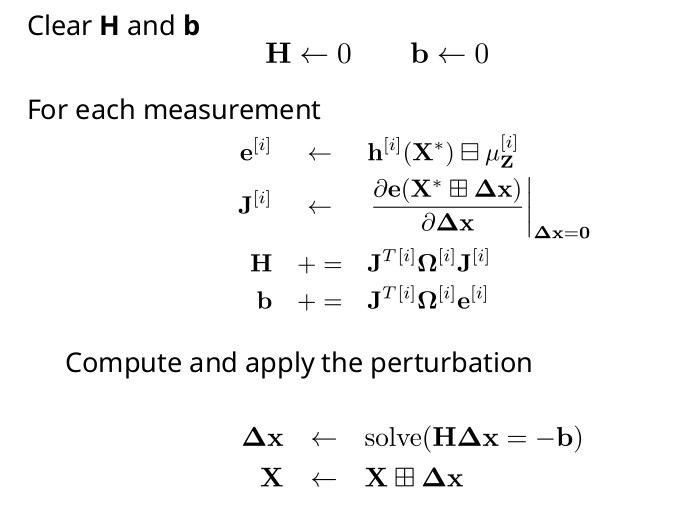

In the proposed implementation, for each epoch, the algorithm takes the result computed by ICP for the previous epoch as initial guess. The obtained result is compared to the ground truth.

## Second Step: Robust Kernel and Data Association Policy
In the second step, a robust kernel was added to the ICP algorithm in order to lessen the contribution of outliers. Furthermore, the unknown data association case was addressed. 

### Data Association 
The data association is addressed using a nearest neighbor strategy. This part is handled in the `dataAssociation.m` file.

Firstly, all the landmarks are projected in the cameras according to $X$, forming three matrices (one for each camera). Then, for each measurement, the association matrix is computed taking in account the matrix obtained considering the camera from which the measurement was perceived. 

A gating strategy is used to compute the associations, considering the projection error. In our case, the same landmark can be observed by two cameras in the same epoch (and appear in a different position in each of them, because the cameras are mounted on the robot with different positions and orientations), so we cannot assume that one landmark should be paired with just one measurement. 

### Third Step: Addressing the Global Localization Case with RANSAC
RANSAC (Random Sample Consensus) is a methodology used for 3D point registration in order to estimate the pose when the correspondences and the initial guess are unknown. 

It can be summarized as follows: 
- Firstly, a minimal set of correcpondences is sampled from the candidate ones
- Then an alignment is computed
- Said alignment is used to determine the number of good/bad correspondences
- The 'consensus' of the guess is computed as a function of the number of inliers and the error
- The whole procedure is repeated N times, and at each time the best solution is kept
- Then the inliers are used to refine the solution
So, in the last step of the project, the global localization case was addressed in order to compute an initial guess to be used by ICP. 
The code of this part is in the `Ransac.m` file.

In the proposed implementation, the global localization case was addressed running RANSAC on one of the cameras (camera 0). The pose used for the first initialization is the identity. 

At each iteration: 
- Candidate correspondences are built projecting the points according to the best estimation found (during the first iteration, the identity) and handling data association with the same strategy used for the previous step, but with a less restrictive value for gating tau. 
- 10 correspondences are selected randomly among the candidates
- Said correspondences are used to compute a new pose with ICP (in this case, we call a different function (`doIcpRANSAC`), which doesn't handle the data association part in the loop). The best soultion found is used as initial guess
- The landmarks are projected in the new pose estimated by ICP
- The number of inliers is computed according to the chosen gating tau, which works as a threshold. We also calculate the cost summing the distance values.
- If the result is better in terms of inliers and cost, or if the number of inliers is the same, but we have a lower cost, R_best and t_best are updated

Finally, the best solution is refined using all the inliers found. 

# Results and Plots
The system computes an accurate estimate of the whole trajectory, with a trajectory error in the order of $10^{-5}$. 
## Trajectory Plots
The images below shows a comparison between the estimated trajectory (red) and the ground truth (blue). A file containing all poses estimated by the system (`poses.dat`)  is contained in the output folder. 

    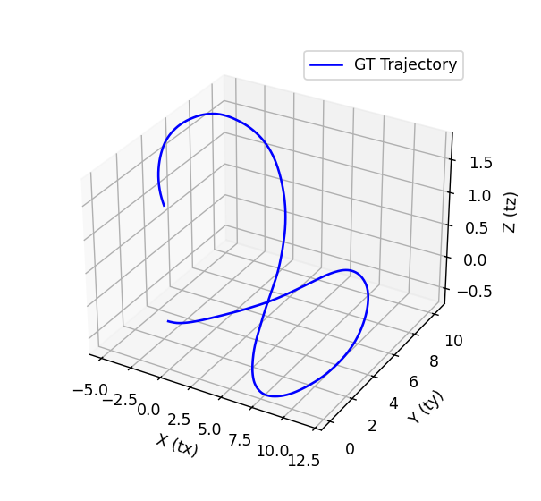
    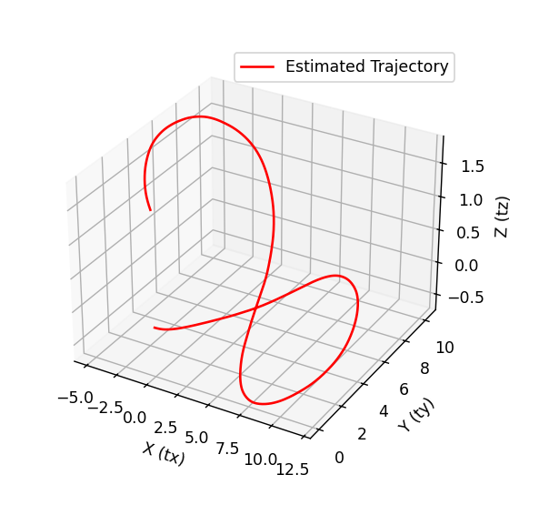
    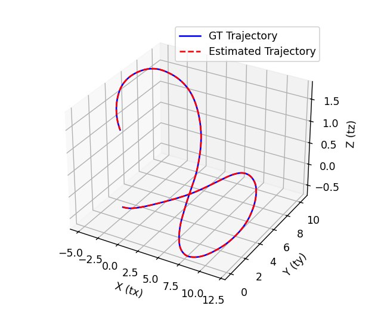
    
    

## ICP error evolution
The below plots were obtained running ICP in order to estimate the pose of the first epoch starting from different initial guesses. As we can see, the performance of Iterative Closest Point depends from the suitability of the provided initial guess.

    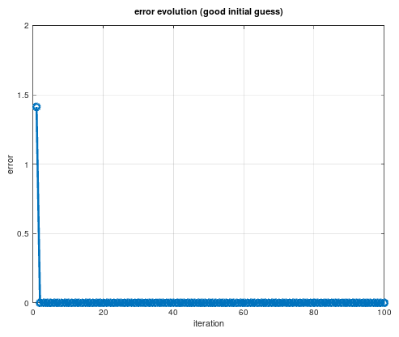
    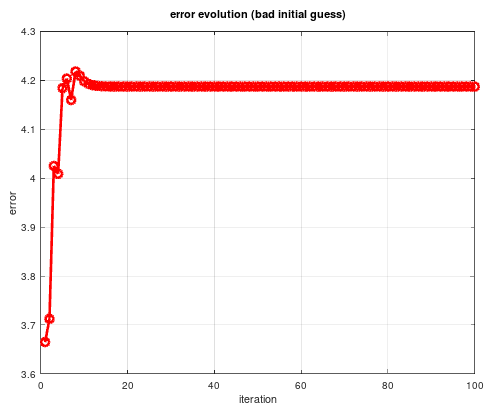
    

## Trajectory error evolution 
The table below shows the trajectory error computed during the first epochs (including epoch 0, in which the pose was estimated running RANSAC). The values remain on the order of $10^{-5}$. The output folder contains a file (`error.dat`) storing the error values collected during the whole trajectory.

| Epoch | tx | ty | tz | qx | qy | qz | qw |
|------|------|------|------|------|------|------|------|
| 0 (ransac) | 0.000016| -0.000009| -0.000008 |0.000044| 0.000049| -0.000045 |0.000000|
| 1 |0.000013 |0.000003 |0.000019 |0.000034| 0.000025| 0.000004| 0.000000|
| 2 | 0.000009| 0.000003| 0.000009| -0.000008| 0.000012| 0.000001 |0.000001|
| 3 | 0.000006| 0.000000| 0.000011 |0.000035 |-0.000016| -0.000022| 0.000004|
| 4 |  0.000002 |-0.000014| 0.000015| 0.000008| -0.000022| -0.000048| 0.000007|
| 5 | 0.000010| -0.000037 |0.000006| 0.000015| 0.000035| 0.000048| 0.000013|
|6  | 0.000001| 0.000028 |0.000008 |0.000023| -0.000002| -0.000005| 0.000020|
|7 | 0.000005 |-0.000025| -0.000003 |0.000010 |-0.000022 |0.000041 |0.000021|
|8 | 0.000005| 0.000019| -0.000010 |0.000000 |0.000015| -0.000044| 0.000027|
|9 | 0.000005| 0.000047| -0.000013| 0.000038| -0.000045| -0.000045| 0.000032|
|10 | 0.000004| -0.000040| -0.000021| -0.000038| -0.000009 |0.000010| 0.000037|
|11 | 0.000007| -0.000041| -0.000029| 0.000011| 0.000020 |-0.000022| 0.000044|

Here we can see some plots displaying the behavior of the single components of the error during the whole trajectory.

    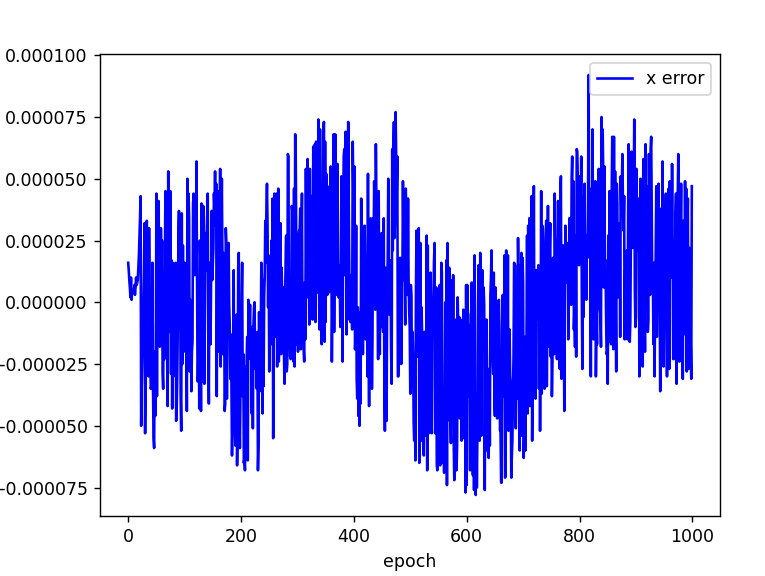
    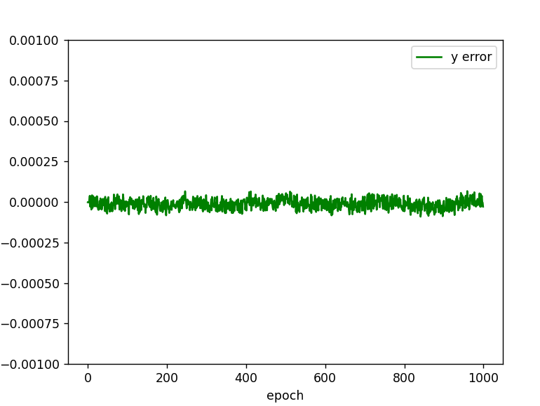
    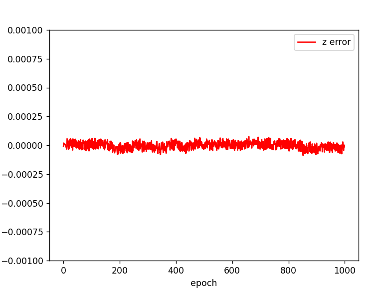
    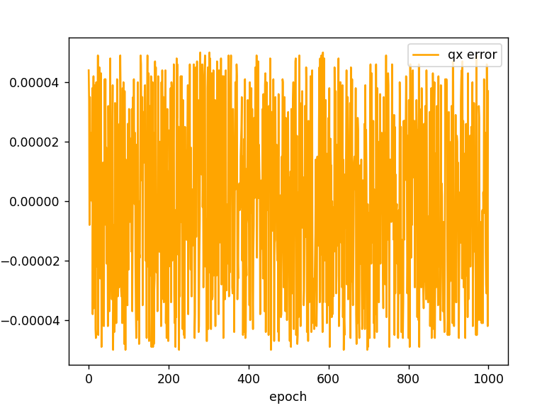
    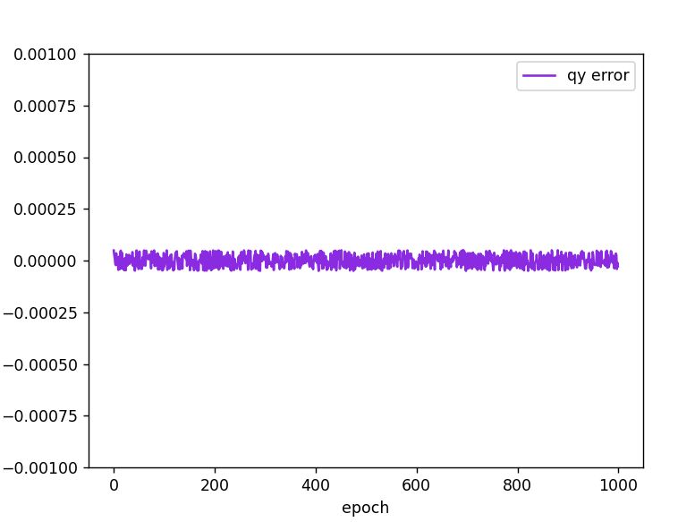
    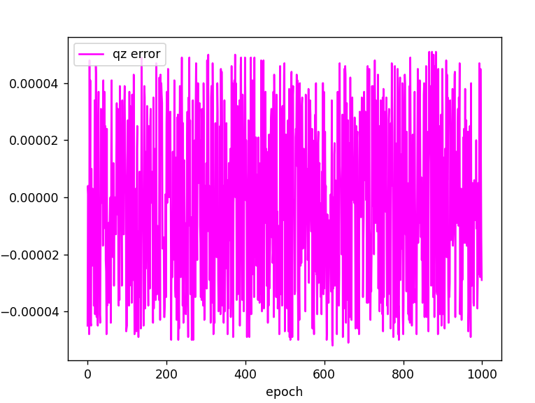
    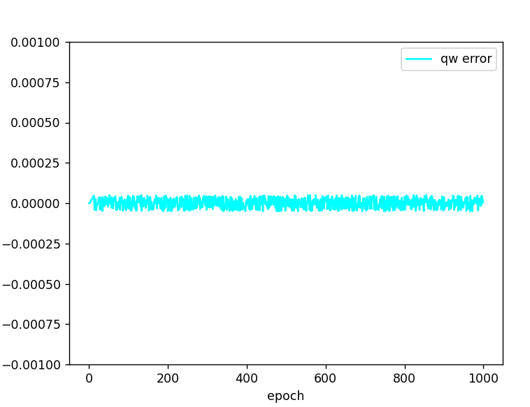

# Repository Structure

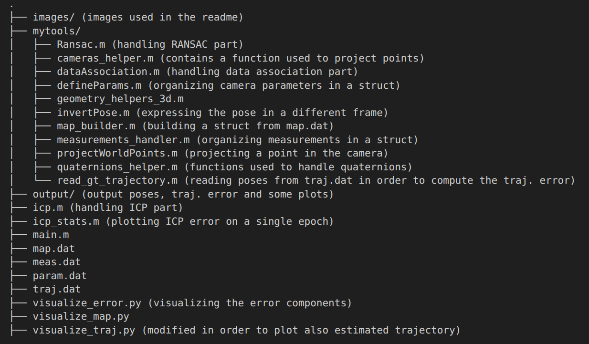

# How to perform a test
In order to test the code, it is sufficient to run the `main.m` file. The new output files `poses.dat` and `error.dat` will be created in the main folder.

In order to plot the new obtained results using `visualize_traj.py` or `visualize_error.py`, the paths of the output files should be changed.

